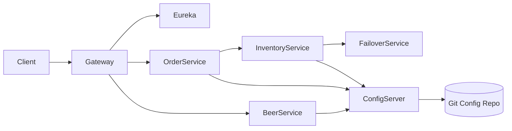
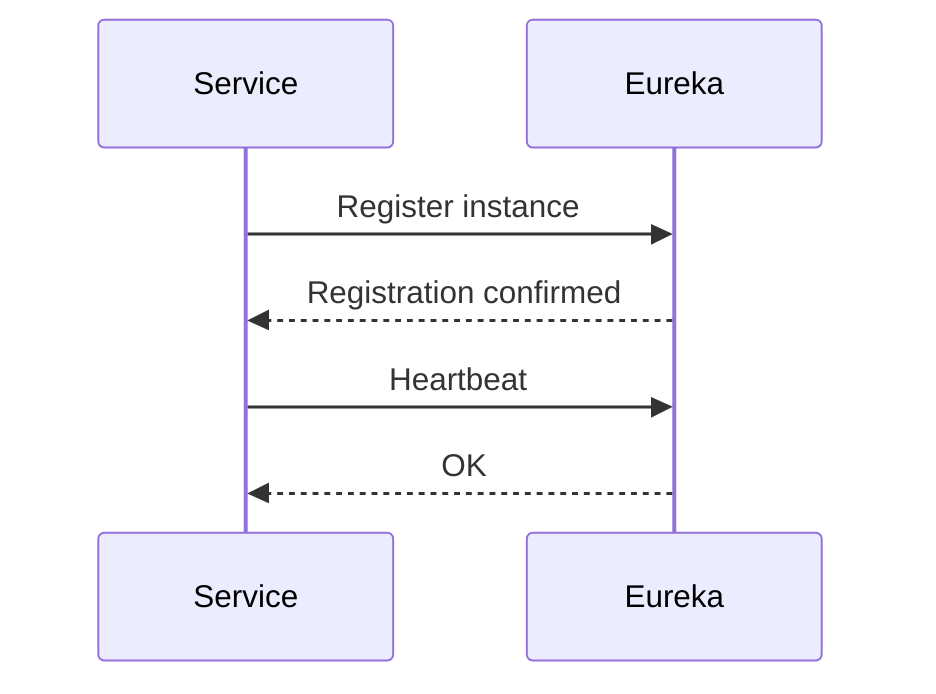
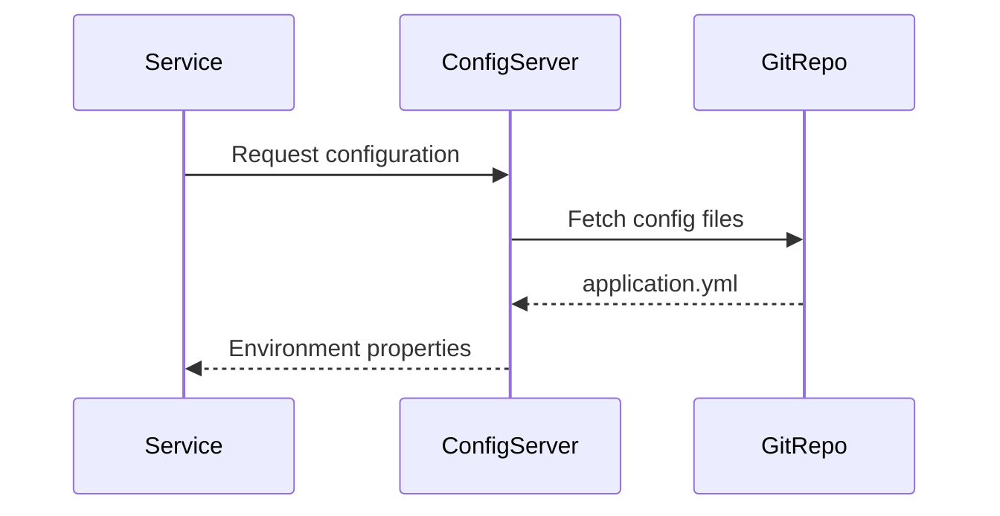
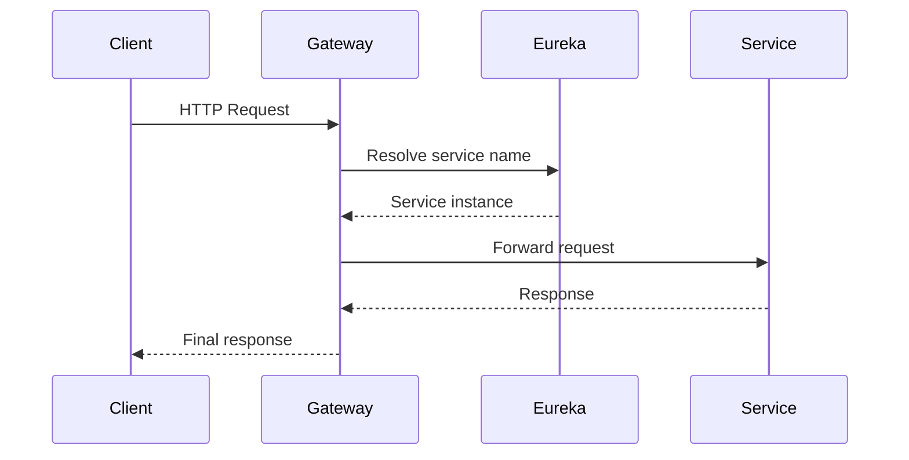

## 📦 mssc-brewery-gateway

# 🌐 Brewery API Gateway

The **API Gateway** is the single entry point for external clients.

## Responsibilities
- Route requests to internal services
- Integrate with Eureka for dynamic routing
- Handle cross-cutting concerns

## Tech Stack
- Spring Cloud Gateway
- Load Balancer

## 1️⃣ Architecture & Flow Diagrams

### 🌐 High-Level Microservices Architecture



---

### 🔍 Service Discovery Flow



---

### ⚙️ Configuration Loading Flow



---

## 2️⃣ Security & Gateway Flow

### 🔐 Security Responsibility Model

| Layer             | Responsibility                             |
| ----------------- | ------------------------------------------ |
| API Gateway       | Authentication, request filtering, routing |
| Internal Services | Authorization, service-to-service trust    |

---

### 🔁 Request Flow with Security



### Notes

* Gateway is the **single external entry point**
* Services are **not exposed directly**
* Security policies can be centralized at the gateway level

---

## 3️⃣ How to Run the Whole System Locally

### ✅ Prerequisites

* Java 17+
* Maven 3.x
* Git

---

### ▶️ Startup Order (Important)

Start services in the following order:

1. **Config Source (Git repo)**

   * No runtime needed (configuration only)

2. **Config Server** (`mssc-brewery-config`)

   ```bash
   mvn spring-boot:run
   ```

3. **Eureka Server** (`mssc-brewery-eureka`)

   ```bash
   mvn spring-boot:run
   ```

4. **Core Services** (any order after Eureka)

   * `mssc-beer-service`
   * `mssc-beer-inventory-service`
   * `mssc-beer-order-service`
   * `mssc-beer-inventory-failover-service`

5. **API Gateway** (`mssc-brewery-gateway`)

---

### 🌍 Local Endpoints

| Component        | URL                                                      |
| ---------------- | -------------------------------------------------------- |
| Eureka Dashboard | [http://localhost:8761](http://localhost:8761)           |
| API Gateway      | [http://localhost:9090](http://localhost:9090) (example) |
| Config Server    | [http://localhost:8888](http://localhost:8888)           |

---
